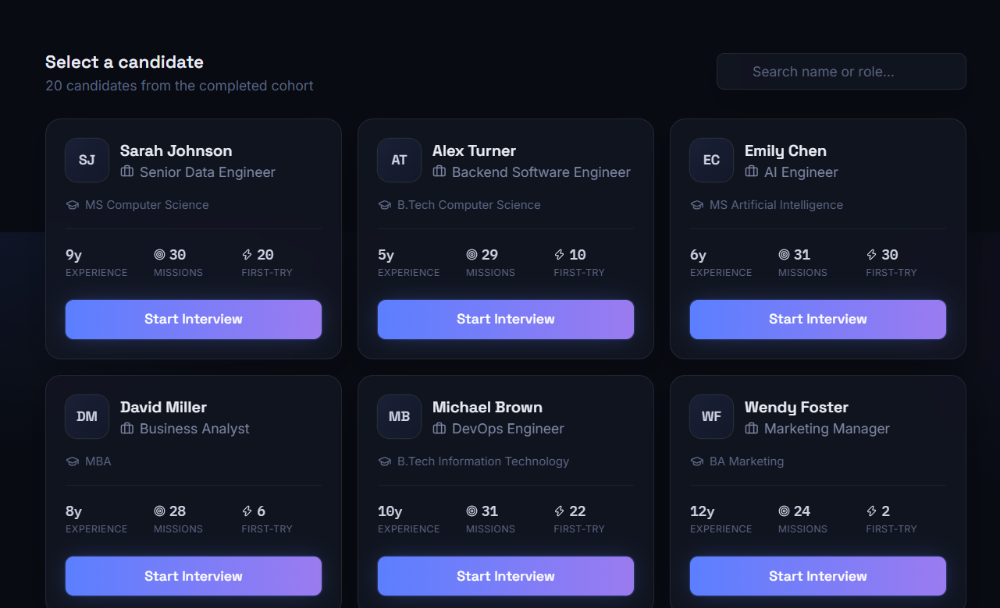
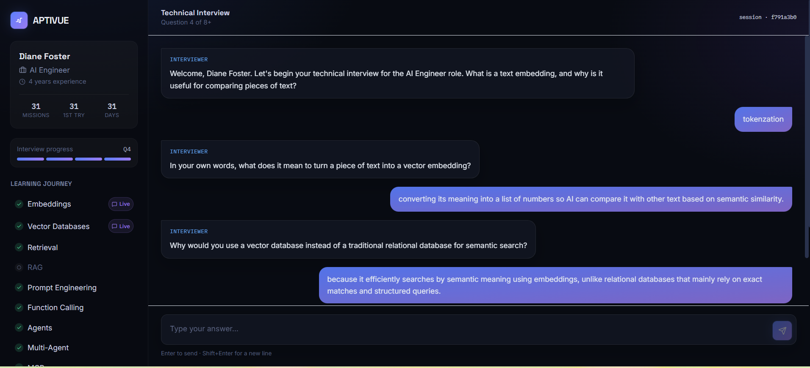
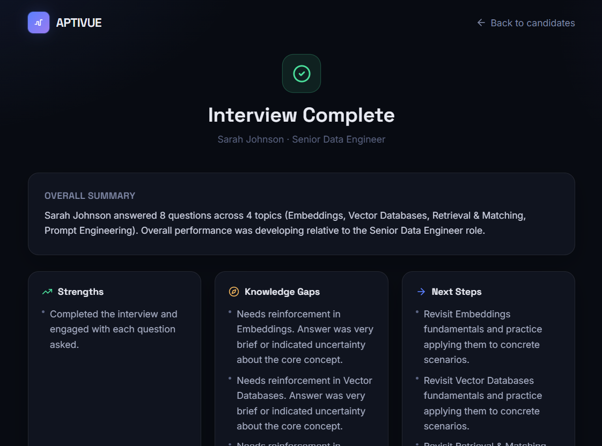

# 🧠 Aptivue

### AI-Powered Adaptive Technical Interview Agent

> **Role-aware • Adaptive • AI-powered • Non-repeating • Structured Feedback**

Aptivue conducts technical interviews that adapt to the candidate's **role, experience, topic coverage, and previous answers**, instead of following a fixed question list.

---

## 🔗 Quick Links

| 🌐 Live Demo | 💻 Source Code | 🤖 AI Usage Log |
|---|---|---|
| [**Open Aptivue**](https://aptivue.vercel.app) | [**GitHub Repository**](https://github.com/Dixa08/Aptivue) | [**PROMPTS.md**](PROMPTS.md) |

---

## 🎯 Problem

Traditional technical interviews often rely on fixed question lists and provide the same experience to every candidate.

**Aptivue introduces an adaptive interview flow** where the next question is influenced by:

- Candidate role & experience
- Technical topic
- Previous answers
- Answer quality
- Topic coverage
- Current difficulty level

---

## 📸 Product Preview

### 👤 Candidate Setup

<p align="center">
  
</p>

### 💬 Adaptive Technical Interview

<p align="center">
  
</p>

### 📊 Interview Feedback

<p align="center">
  
</p>

---

## ✨ Key Features

| Feature | What it does |
|---|---|
| 🎯 **Role-Aware** | Tailors questions to the candidate's role and experience |
| 🧠 **Adaptive Difficulty** | Adjusts question depth based on performance |
| 🔄 **Non-Repeating** | Tracks previously asked questions |
| 📚 **Multi-Topic** | Covers multiple technical domains |
| 🤖 **LLM-Powered** | Generates contextual interview questions |
| 🛡️ **Fallback System** | Uses a deterministic question bank when needed |
| 📊 **Structured Feedback** | Identifies strengths, knowledge gaps, and next steps |

---

## 🔄 How It Works

```text
                    👤 Candidate
                         │
                         ▼
                ┌─────────────────┐
                │ Candidate Setup │
                └────────┬────────┘
                         │
                         ▼
                ┌─────────────────┐
                │ Interview State │
                └────────┬────────┘
                         │
                         ▼
              ┌──────────────────────┐
              │ Topic + Difficulty   │
              │     Selection        │
              └──────────┬───────────┘
                         │
                         ▼
              ┌──────────────────────┐
              │   Question Generator │
              │  Claude + Fallback   │
              │    Question Bank     │
              └──────────┬───────────┘
                         │
                         ▼
                   💬 Question
                         │
                         ▼
                    👤 Answer
                         │
                         ▼
              ┌──────────────────────┐
              │   Answer Evaluation  │
              └──────────┬───────────┘
                         │
                         ▼
                   🔄 Update State
                         │
                         ▼
                  Next Question
                         │
                         ▼
                📊 Final Feedback

```
# project structure
```
Aptivue/
│
├── 📁 frontend/
│   ├── 📁 src/
│   │   ├── 📁 components/
│   │   ├── 📁 data/
│   │   ├── 📁 lib/
│   │   ├── 📁 types/
│   │   ├── 📄 App.tsx
│   │   └── 🎨 index.css
│   │
│   ├── 📄 package.json
│   ├── 📄 vite.config.ts
│   └── 📄 tsconfig.json
│
├── 📁 backend/
│   ├── 🐍 interview_agent.py
│   ├── 🐍 main.py
│   └── 📄 requirements.txt
│
├── 📁 doc/
│   ├── 🖼️ candidate-selection.png
│   ├── 🖼️ interview.png
│   └── 🖼️ feedback.png
│
├── 🤖 PROMPTS.md
├── 📖 README.md
└── 🚫 .gitignore

```
---

## 👩‍💻 Team

### Dixa Rawat

**B.Tech CSE | AI & ML**

Built with curiosity, AI-assisted development, and a focus on making technical interviews more adaptive.

🔗 **GitHub:** [Dixa08](https://github.com/Dixa08)

---

<p align="center">
  <strong>🧠 Aptivue</strong><br>
  <i>Making technical interviews adaptive.</i>
</p>
